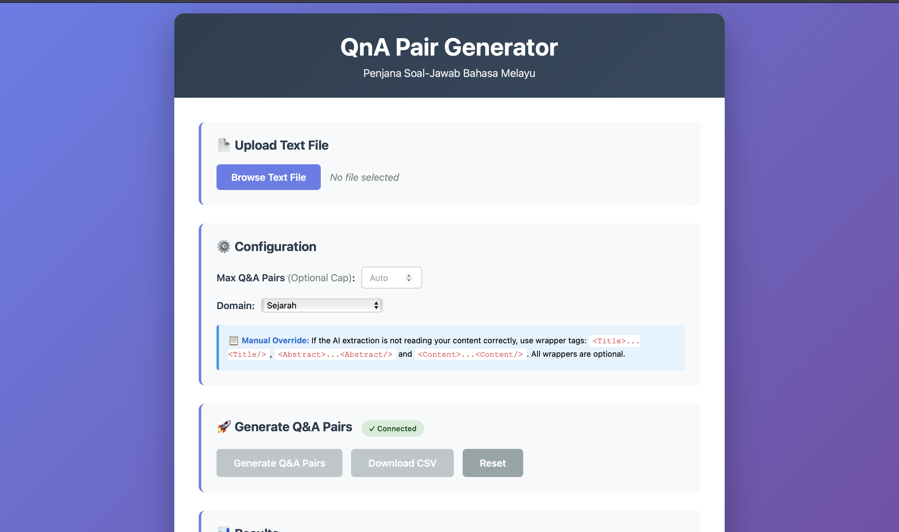
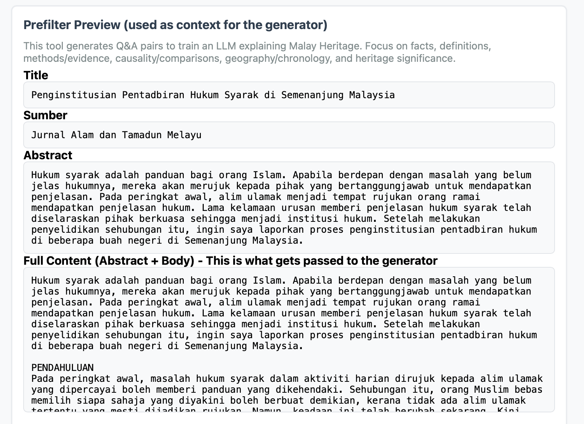
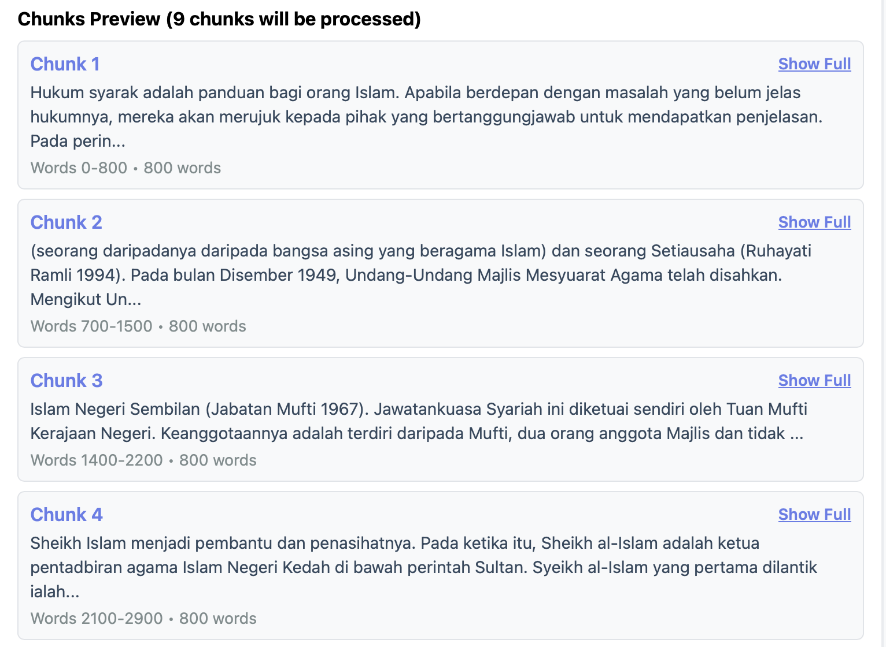
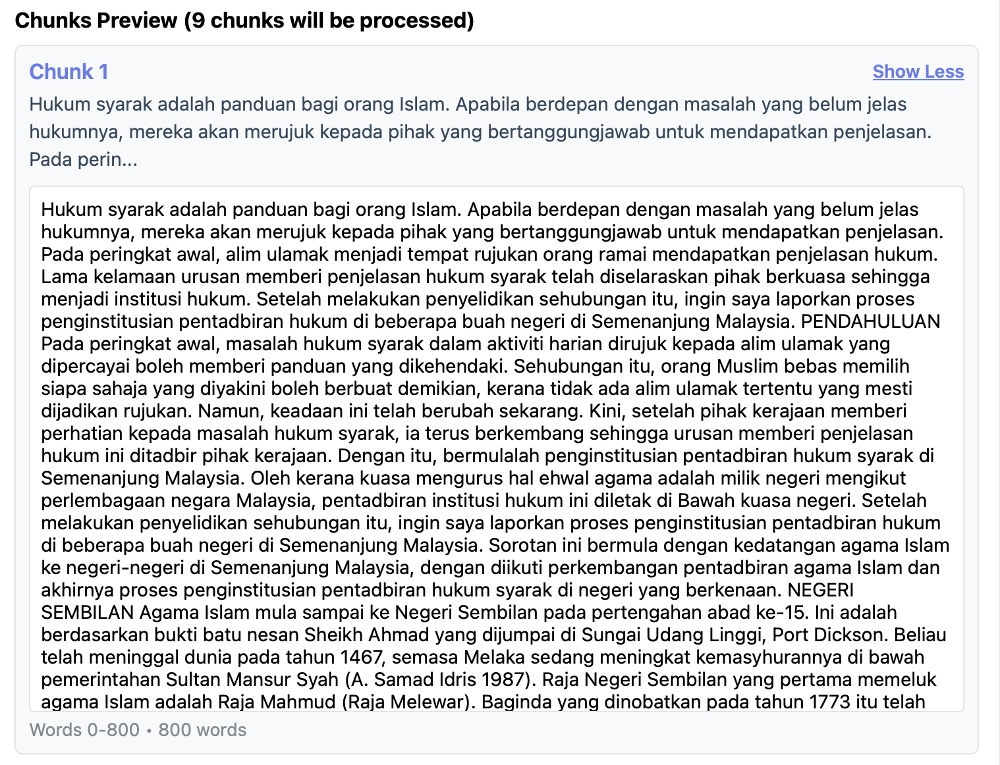
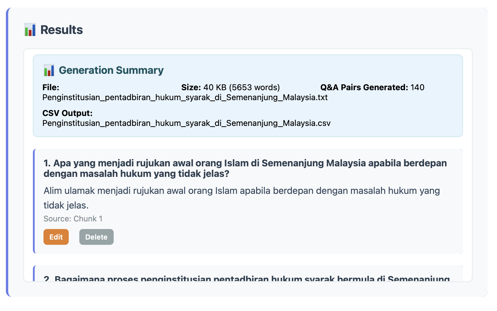
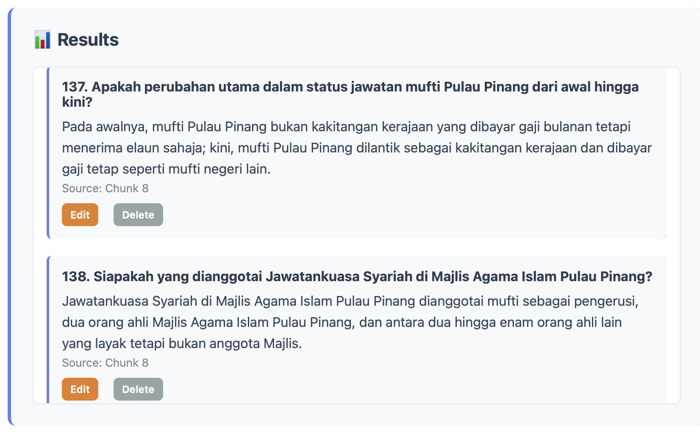
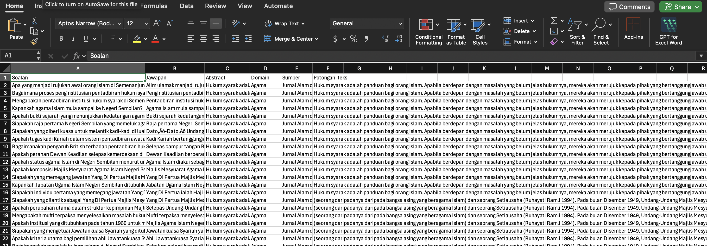

# QnA Pair Generator (Bahasa Melayu)

> **Turn research text into Q&A pairs automatically** — Upload a document. Get question-answer pairs for AI training. Download as CSV.

<p align="center">
  
  
  
  
  
</p>

<p align="center">
  
</p>

---

## What Is This?

A web application that uses AI to create question-answer datasets from Malay academic texts.

**The Problem**: Researchers need Q&A pairs for training AI models. Making these by hand takes a long time and is boring.

**The Solution**: This tool does it automatically. You upload a text file. The system creates good Q&A pairs. You can edit them. Then download as CSV.

**Key Features**:

| Feature | Description |
| --- | --- |
| Upload | Accept `.txt` files or paste text directly |
| Auto Split | Break documents into chunks automatically |
| Generate | AI creates question-answer pairs |
| Clean | Remove duplicates and bad pairs |
| Edit | Modify any pair before saving |
| Export | Download results as CSV |
| Collaborative | Built with researcher feedback |

---

## How It Works

### Step 1: Upload Text
Upload a `.txt` file with your research document.

Optional: Add tags like this:
```
<Title>My Document Title</Title>
<Abstract>Summary of the document</Abstract>
<Content>The main text here...</Content>
```

### Step 2: Preview
The system shows you:
- Extracted title, summary, and body
- How many text chunks it created
- A preview of the first chunk

### Step 3: Generate Q&A
Click "Generate". The system:
1. Splits text into chunks
2. Creates Q&A candidates from each chunk
3. Removes duplicates
4. Saves results to database
5. Shows progress in real-time

### Step 4: Review & Edit
See all generated pairs in a table. You can:
- Edit any question or answer
- Delete bad pairs
- Check the source text for each pair

### Step 5: Download
Click "Download CSV". Get a file with columns:
- `Soalan` (Question)
- `Jawapan` (Answer)
- `Abstract` (Document summary)
- `Domain` (Category)
- `Sumber` (Source)
- `Potongan_teks` (Text chunk)

---

## Screenshots

### Main UI

<p align="center">
  
</p>

### Extraction & Chunking

| Prefilter extraction | Chunk preview | Extended chunk preview |
| :---: | :---: | :---: |
|  |  |  |

### Generation & Review

| Live generation updates | Generation summary | Edit / Delete results |
| :---: | :---: | :---: |
|  |  |  |

### CSV Export

<p align="center">
  
</p>

---

## System Design

### Architecture Diagram

The system has three layers:


| Layer | What It Does |
| --- | --- |
| **UI Layer (top)** | Web interface - Upload, show progress, edit results, download CSV |
| **Processing Layer (middle)** | AI workflow - Chunk text, generate pairs, review, deduplicate |
| **Storage Layer (bottom)** | Database - Save results, AI API, system prompts |

### Processing Pipeline

For each text chunk, this happens in order:


**The Steps**:

1. **Check Quality** (Prefilter) — Is this chunk worth processing? If no → skip it
2. **Generate** — AI creates 10-20 question-answer candidates
3. **Review** (Optional) — AI checks each pair, decides: accept, edit, or reject
4. **Remove Duplicates** — Delete similar questions
5. **Save** — Store good pairs in database

**All chunks run in parallel** using multiple workers at the same time = faster processing.

---

## Tech Stack

| Layer | Technology | Purpose |
| --- | --- | --- |
| **Backend** | Python 3.10+ | Core language |
| **Web Framework** | Flask 2.3+ | HTTP server and routing |
| **AI Orchestration** | LangGraph | Workflow management (filter → generate → review) |
| **LLM Integration** | OpenAI Python SDK | Connect to any OpenAI-compatible API |
| **Parallel Processing** | ThreadPoolExecutor | Process multiple chunks simultaneously |
| **Database** | SQLite + WAL | Store generations and results |
| **Frontend** | HTML/CSS/JavaScript | Web UI (vanilla, no frameworks) |
| **Streaming** | Server-Sent Events (SSE) | Real-time progress updates |
| **Text Processing** | Python regex | Duplicate detection, filtering |
| **API Format** | JSON/JSONL | Q&A pair format from AI |

**Dependencies** (see `requirements.txt`):
- `openai` — LLM API client
- `flask` — Web server
- `langchain` + `langgraph` — AI workflow
- `python-dotenv` — Environment variable management
- `langsmith` (optional) — Debugging and tracing

**Supported AI Models**:
- Any OpenAI-compatible API
- Examples: Qwen, Claude, GPT-4, Llama
- Uses OpenRouter or similar services

---

## Installation & Setup

### 1. Get the Code

```bash
git clone https://github.com/zuftt/langsmith-qna-pair-generator.git
cd qna-pair-generator
```

### 2. Create Virtual Environment

```bash
python3 -m venv .venv
source .venv/bin/activate  # Windows: .venv\Scripts\activate
```

### 3. Install Dependencies

```bash
pip install -r requirements.txt
```

### 4. Create `.env` File

Create a file named `.env` in the project folder:

```
OPENAI_API_KEY=your_api_key
OPENAI_BASE_URL=https://openrouter.ai/api/v1
QWEN_GEN_MODEL=qwen/qwen3-next-80b-a3b-instruct
QWEN_REVIEW_MODEL=qwen/qwen3-next-80b-a3b-instruct

QNA_MAX_WORKERS=10
QNA_GEN_RETENTION_DAYS=7
```

**What each setting means**:
- `OPENAI_API_KEY` = Your AI API key
- `OPENAI_BASE_URL` = Where the AI service is
- `QWEN_GEN_MODEL` = AI model for creating pairs
- `QWEN_REVIEW_MODEL` = AI model for checking pairs
- `QNA_MAX_WORKERS` = How many chunks to process at the same time
- `QNA_GEN_RETENTION_DAYS` = Keep old results for N days, then delete

### 5. Start the Application

```bash
python3 web.py
```

Open your web browser:
```
http://localhost:8080
```

You should see the upload page.

---

## Settings You Can Change

### Optional Settings

| Name | Default | What It Does |
| --- | --- | --- |
| `QNA_CHUNK_WORDS` | 800 | Words per chunk |
| `QNA_CHUNK_OVERLAP` | 100 | Overlap between chunks |
| `QNA_DUP_QUESTION_SIM` | 0.88 | How similar questions must be to count as duplicates (0-1) |
| `QNA_GENERATIONS_DB_PATH` | `data/generations.db` | Where to save the database |

### For Debugging

```
LANGCHAIN_TRACING_V2=true
LANGSMITH_API_KEY=your_key
```

This helps you see what the AI is doing step by step.

---

## API Endpoints

If you want to use this programmatically (not through the web UI):

| Method | URL | What It Does |
| --- | --- | --- |
| POST | `/api/extract` | Extract text from file |
| POST | `/api/preview-chunks` | Show text chunks |
| POST | `/api/generate` | Start Q&A generation |
| GET | `/api/generations/<id>/pairs` | Get all pairs |
| PATCH | `/api/generations/<id>/pairs/<pair_id>` | Edit a pair |
| DELETE | `/api/generations/<id>/pairs/<pair_id>` | Delete a pair |
| POST | `/api/download-csv` | Download as CSV |
| GET | `/api/health` | Check if system is working |

Example:
```bash
curl -X POST -F "file=@document.txt" http://localhost:8080/api/extract
```

---

## File Structure

```
QnA_Pair_Generator/
├── web.py                   # Web server
├── core.py                  # Main logic
├── generation_db.py         # Database code
├── agents/
│   └── graph.py             # AI workflow
├── prompts/
│   ├── prefilter_system.txt # Instructions for filtering
│   ├── generator_system.txt # Instructions for generating
│   └── reviewer_system.txt  # Instructions for reviewing
├── templates/
│   └── index.html           # Web page
├── data/                    # Database file location
└── requirements.txt         # Python packages needed
```

---

## How AI Generates Pairs

### The Three Stages

**Stage 1: Prefilter (Optional)**
- AI checks: Is this chunk good quality?
- If no: Skip it
- If yes: Continue to next stage

**Stage 2: Generate**
- AI reads the chunk
- AI creates 10-20 Q&A candidate pairs
- Pairs are saved as JSON

**Stage 3: Review (Optional)**
- AI checks each pair
- Decision: Accept, Edit, or Reject
- If Accept or Edit: Keep it
- If Reject: Throw away

**Stage 4: Clean**
- Remove duplicates
- Remove pairs about the document itself (like "What is this text?")
- Save good pairs to database

---

## Troubleshooting

### Problem: API Error

**"Invalid API key"**
- Check your `OPENAI_API_KEY` in `.env`
- Make sure it's correct

**"Rate limit exceeded"**
- The AI service is busy
- Wait a few minutes and try again
- Or reduce `QNA_MAX_WORKERS` in `.env`

### Problem: No Text Chunks Created

- Your document is too short
- Add more text (at least 50 words per chunk)

### Problem: Too Many Duplicate Pairs

- Change `QNA_DUP_QUESTION_SIM` to `0.80` (lower number = more strict)

### Problem: Database Locked

- Close other instances of the program
- Delete `data/generations.db-wal` file if it exists

---

## Tips for Better Results

### 1. Format Your Text
Use wrapper tags for best results:
```
<Title>Document Title</Title>
<Abstract>Summary paragraph</Abstract>
<Content>Main text here...</Content>
```

### 2. Use Good Source Text
- Academic papers work well
- News articles work well
- Wikipedia text works well
- Very short texts (< 500 words) may not work well

### 3. Set Reasonable Targets
- Start with `max_pairs = 20`
- Increase if you want more pairs
- Too high targets may produce bad pairs

### 4. Use Review Stage for Quality
- First time: Use fast mode (skip review)
- For important projects: Enable review
- Review takes 2-3x longer but quality is better

### 5. Edit Results
- Don't accept all pairs automatically
- Review the table of results
- Delete pairs that don't make sense
- Edit questions for clarity

---

## How This Was Built

This is not a generic tool. It was built by a researcher to solve a real problem:

**The Problem**: Creating Q&A datasets for Malay AI training takes weeks of manual work.

**The Solution**: Built custom AI software that automates pair generation.

**The Process**: 
1. Started with basic AI prompt
2. Tested with researchers
3. Got feedback: "Too many duplicates", "Need editing", "Show progress"
4. Added deduplication, editing UI, live progress
5. Tested again with more documents
6. Got feedback: "Need quality review stage"
7. Added optional AI review
8. Tested with real academic texts
9. Refined prompts based on what worked

**The Result**: A tool that researchers actually use. Not perfect, but practical.

---

## What's Technical About This

For developers:

- **LangGraph**: Manages the workflow (filter → generate → review → clean)
- **ThreadPoolExecutor**: Processes multiple chunks at the same time
- **SQLite**: Saves results so you can edit them later
- **Flask**: Web server and API
- **SSE (Server-Sent Events)**: Sends progress updates to browser in real-time
- **OpenAI SDK**: Talks to any AI service (Qwen, Claude, GPT-4, etc.)

Key design choices:
- **Per-chunk state machines**: Each chunk follows the same path independently
- **Parallel processing**: N chunks at the same time = faster
- **Shared deduplication**: One lock protects the question list
- **Editable results**: Database is source of truth, not final output
- **Structured prompts**: CLEAN_TEXT blocks reduce confusion

---

## Common Questions

**Q: Do I need to know programming?**  
A: No. Just use the web interface.

**Q: Can I use this for other languages?**  
A: Maybe. The AI prompts are in Bahasa Melayu. You'd need to translate them.

**Q: How long does it take?**  
A: Depends on text length. Example: 2000-word document = 2-5 minutes.

**Q: Is my data private?**  
A: Yes. Everything runs on your computer. Data is saved locally in SQLite.

**Q: Can I use ChatGPT instead of Qwen?**  
A: Yes, if you have an OpenAI key and update the model names in `.env`.

**Q: What if I want to run this on a server?**  
A: Change `host='0.0.0.0'` in `web.py` and run on your server.

---

## License & Contact

- Built with Python, Flask, LangGraph, and SQLite
- For questions or improvements: contact the author
- Bug reports welcome on GitHub

---

## Getting Help

1. Check the **Troubleshooting** section above
2. Read the **Tips** section for better results
3. Look at the API examples if using programmatically
4. Check `.env.example` if it exists
